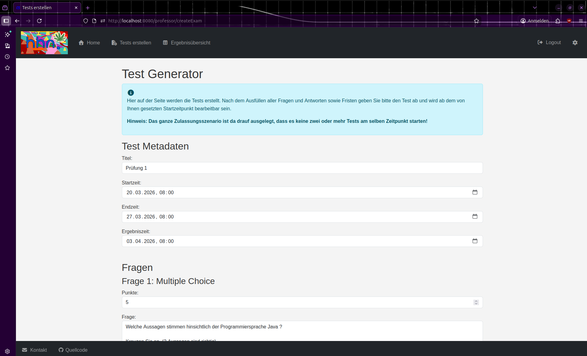
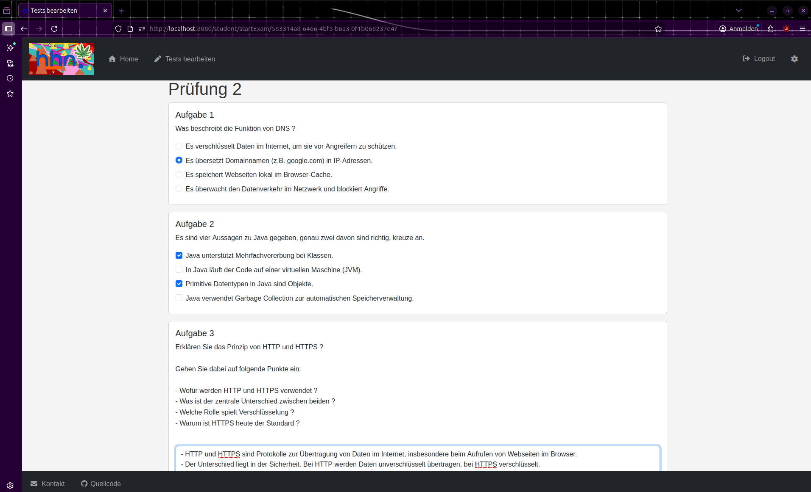
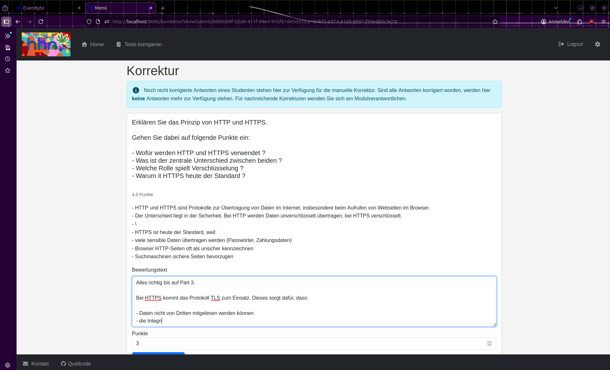
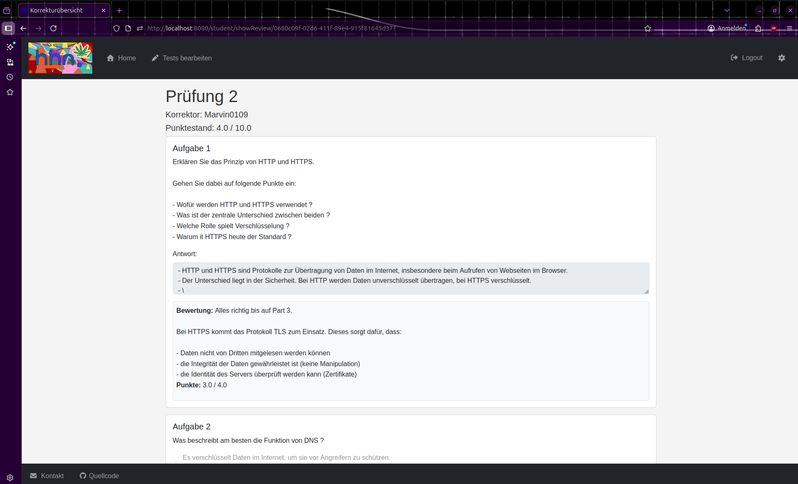
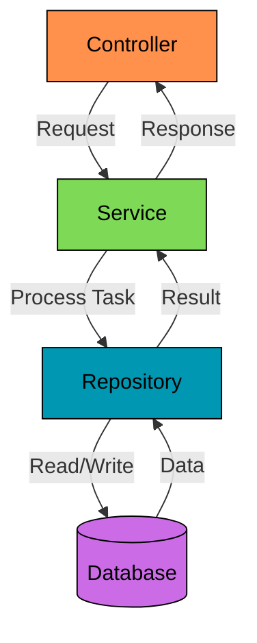
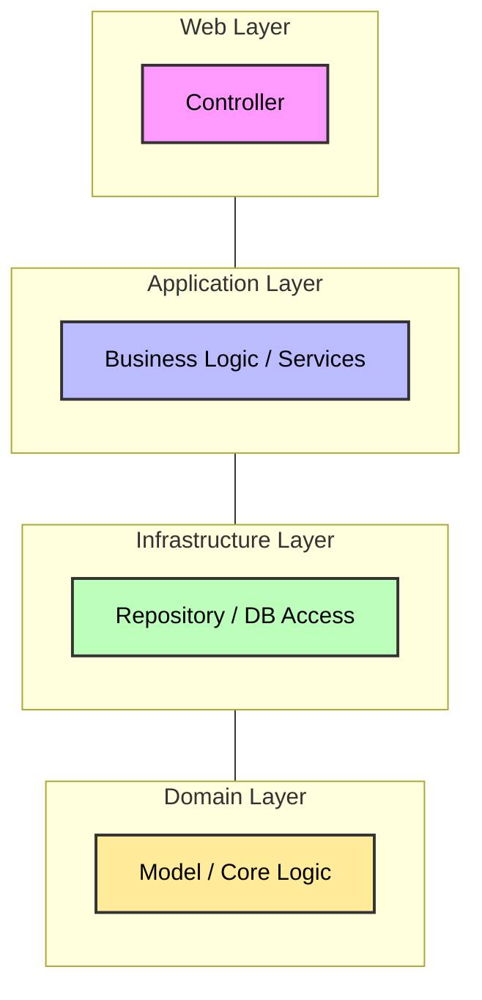

<p align="center">
    
</p>

# ExamByte

## Übersicht

- [Was ist ExamByte?](#was-ist-exambyte)
- [Funktionen](#funktionen)
- [Lokale Entwicklung (Linux)](#lokale-entwicklung-linux)
- [Nutzung und Demo](#nutzung)
- [Architektur](#architektur)
- [Dokumentation](#dokumentation)
- [Mitwirkende](#mitwirkende)

> [!NOTE]
> Die Weiterentwicklung von ExamByte endete am **24.03.2026**. 
> 
> Nach umfangreicher Entwicklungszeit wurde entschieden, die aktuelle Version als final zu betrachten und
> keine weiteren Features oder Anpassungen mehr umzusetzen.
> Offene oder geplante Erweiterungen werden nicht weiterverfolgt.
>
> Der zugehörige Entwicklungs-Branch `feature/review-lock` wurde nicht gemerged und entsprechend verworfen.
> Der aktuelle Stand wird als abgeschlossen betrachtet.
>
> Finale Codeüberprüfung ist abgeschlossen, für mehr Details wie mögliche Erweiterungen siehe [To do](docs/todo.md).

## Was ist ExamByte?

ExamByte ist eine Webanwendung zur Durchführung und Bewertung von Tests im Programmierpraktikum.
Es ersetzt ILIAS als Testsystem für die Klausurzulassung und ermöglicht:

- **Automatische Bewertung** von Multiple-Choice-Fragen
- **Manuelle Korrektur** von Freitextaufgaben durch Korrektor:innen
- **Verwaltung von Testergebnissen** für Studierende und Organisator:innen
- **Benutzerverwaltung** mit GitHub-Authentifizierung

## Funktionen

- **Testverwaltung**: Erstellen, Vorschau und Durchführung von Tests
- **Testbewertung**: Automatische Bewertung von MC-Fragen, manuelle Bewertung von Freitextaufgaben
- **Zulassungsstatus**: Studierende sehen ihren Fortschritt und den aktuellen Zulassungsstand
- **Ergebnisübersichten**: Organisator:innen haben eine Gesamtübersicht der Testergebnisse
- **Exportfunktion**: Testergebnisse als CSV-Datei herunterladen

## Lokale Entwicklung (Linux)

### Voraussetzungen
- Java 21
- Github-Account für Authentifizierung
- Docker für die Datenbank
- Einrichtung von SSH für das Klonen des Repository (optional)
- Einsetzen der Credentials in einer `.env`-Datei (verwende hier für `.env.example`)

### Repository klonen mit SSH
```
$ git clone git@github.com:Marvin0109/ExamByte.git
```

Für die lokale Entwicklung kann PostgreSQL in Docker ausgeführt werden, während die 
Spring-Boot-Anwendung direkt auf dem Host-System läuft.

Zuerst den Datenbank-Container starten:
```
$ docker compose up -d exambyteDB
```

Anschließend die Anwendung mit dem `local`-Spring-Profil starten:
```
$ ./gradlew bootRun --args='--spring.profiles.active=local'
```

Die Anwendung ist anschließend unter `http://localhost:8080` erreichbar.

### Anwendung beenden

Die lokal laufende Spring-Boot-Anwendung mit `Strg+C` beenden.

Anschließend die Docker-Container stoppen:
```
$ docker compose down
```

Um zusätzlich das Datenbank-Volume zu löschen, den Parameter `-v` verwenden:
```
$ docker compose down -v
```

## Gesamte Anwendung mit Docker ausführen

Um sowohl die Spring-Boot-Anwendung als auch PostgreSQL vollständig in Docker auszuführen:
```
$ ./gradlew clean bootJar
$ docker compose up -d --build
```

## Nutzung

> [!NOTE]
> 
> Die Screenshots zeigen die grundlegenden Features von ExamByte vom Stand 18.03.2026.
> 
> Weitere Screenshots sind [hier](src/main/resources/static/public/demo).

### Prüfung erstellen



### Prüfung bearbeiten



### Prüfung korrigieren



### Ergebnisanzeige



## Architektur

### Datenfluss und API-Calls


### Abhängigkeiten der Layers (Onion Architektur)


## Dokumentation

- [arc42-Architekturdokumentation](docs/arc42-architecture.md)
- [Aktivitätsprotokoll](docs/activity-log.md)
- [To do](docs/todo.md)
- [Styleguide](docs/style-guide.md)

## Mitwirkende

- Marvin0109 - Hauptentwicklung und Wartung
- muz70wuc - Mitentwicklung in der Anfangsphase

[Zurück zur Übersicht.](#übersicht)

