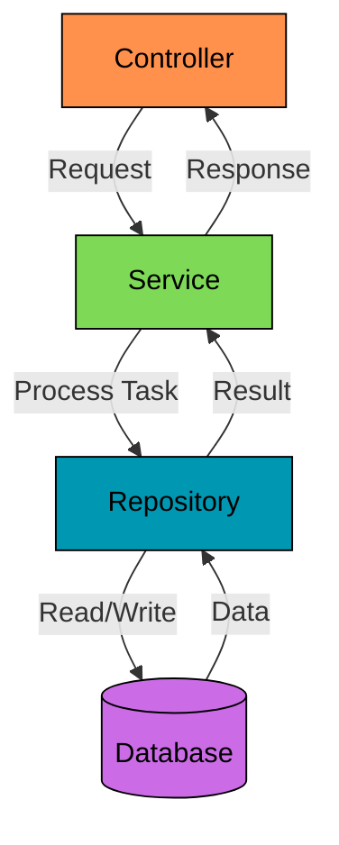
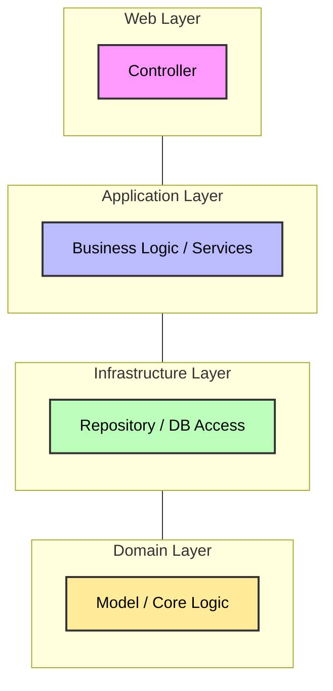

<p align="center">
    
</p>

# ExamByte

ExamByte ist eine Webanwendung zur Durchführung und Bewertung von Tests im Programmierpraktikum. 
Es ersetzt ILIAS als Testsystem für die Klausurzulassung und ermöglicht:

- **Automatische Bewertung** von Multiple-Choice-Fragen
- **Manuelle Korrektur** von Freitextaufgaben durch Korrektor:innen
- **Verwaltung von Testergebnissen** für Studierende und Organisator:innen
- **Benutzerverwaltung** mit GitHub-Authentifizierung

## Funktionen

- **Testverwaltung**: Erstellen, Vorschau und Durchführung von Tests
- **Testbewertung**: Automatische Bewertung von MC-Fragen, manuelle Bewertung von Freitextaufgaben
- **Zulassungsstatus**: Studierende sehen ihren Fortschritt und den aktuellen Zulassungsstand
- **Ergebnisübersichten**: Organisator:innen haben eine Gesamtübersicht der Testergebnisse
- **Exportfunktion**: Testergebnisse als CSV-Datei herunterladen

## Installation

### Voraussetzungen
- Java 21
- Github-Account für Authentifizierung
- Docker für die Datenbank
- Einrichtung von SSH für das Klonen des Repository (optional)
- Einsetzen der Credentials in einer `.env`-Datei (verwende hier für `.env.example`)

### Projekt klonen mit SSH
```
$ git clone git@github.com:Marvin0109/ExamByte.git
```

### Container starten
> [!IMPORTANT]
> Docker Container **immer** vor der Ausführung der `.jar` starten, ansonsten wird die Anwendung nicht starten.
```
$ docker compose up -d
```
   
### JAR-File bauen und starten
```
$ ./gradlew build
$ java -jar build/libs/exambyte-chillex-0.0.1-SNAPSHOT.jar
```
   
> [!WARNING]
> Wenn Testcontainer nicht die Docker API-Version `1.44` erkennen tut, werden die Integrationstests fehlschlagen.
> Workaround:
> - Docker aktualisieren
> - Spring Boot aktualisieren
> - Temporär die API-Version manuell setzen (**langfristig nicht empfohlen**)
>   ```
>   $ echo api.version=1.44 >> ~/.docker-java.properties
>   ```
>   
>   Quellen:
> - [Stackoverflow: Docker-Error about client api version](https://stackoverflow.com/questions/79817033/sudden-docker-error-about-client-api-version)
> - [Github: Testcontainer-Java issues](https://github.com/testcontainers/testcontainers-java/issues/11212#issuecomment-3516573631)
   
### Runterfahren
```
$ ^C # Verwende strg+c
$ docker compose down
```

> [!TIP]
> Falls auch die DB-Daten gelöscht werden sollen, verwende Argument `-v`
> ```
> $ docker compose down -v # Volumes werden gelöscht
> ```

## Nutzung

<video src="src/main/resources/static/public/demo/Login.mp4" width="500" autoplay muted loop></video>

Restliche Demos folgen ...

## Architektur

### Datenfluss und API-Calls


### Abhängigkeiten der Layers (Onion Architektur)



## Dokumentation

- [arc42-Architekturdokumentation](docs/arc42.md)
- [Aktivitätsprotokoll](docs/Activity_Protocol.md)
- [TODO](docs/TO_DO.md)
- [Styleguide](docs/STYLEGUIDE.md)

## Mitwirkende

- Marvin0109 - Hauptentwicklung und Wartung
- muz70wuc - Mitentwicklung in der Anfangsphase

