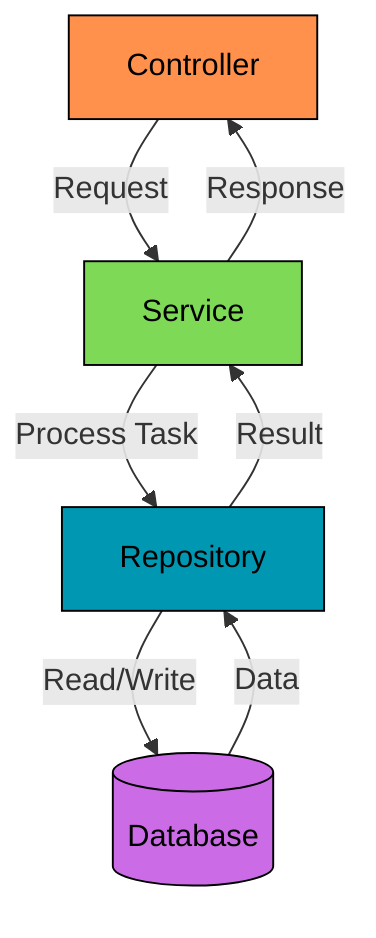
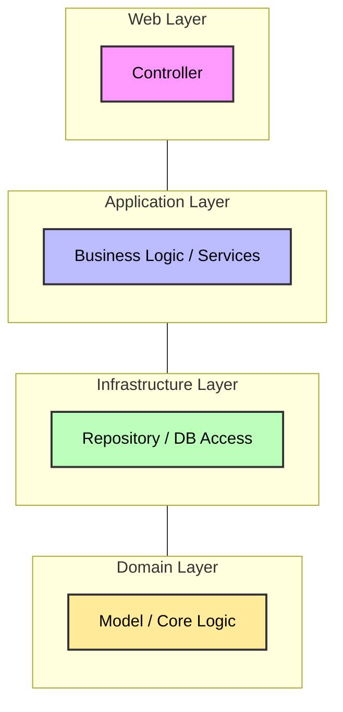

<p align="center">
    
</p>

# ExamByte

## Overview

> [!TIP]
> German version of README check [here.](README.de.md)

- [What is ExamByte?](#what-is-exambyte)
- [Features](#features)
- [Installation (Linux)](#installation-linux)
- [Usage and Demo](#usage-and-demo)
- [Architecture](#architecture)
- [Documentation](#documentation)
- [Contributors](#contributors)

> [!NOTE]
> Development of ExamByte officially ended on **March 24, 2026**.
>
> After extensive development, the current version has been declared final and
> no further features or changes will be implemented.
> Open or planned enhancements will no longer be pursued.
>
> The related development branch `feature/review-lock` was never merged and has therefore been discarded.
> The current state of the project is considered complete.
>
> Final code review has been completed. For more details and possible future ideas, check [To do](docs/todo.md).

## What is ExamByte?

ExamByte is a web application for conducting and grading tests in programming lab courses.
It replaces ILIAS as the testing platform for exam admission and provides:

- **Automatic grading** of multiple-choice questions
- **Manual review** of free-text tasks by reviewers
- **Management of test results** for students and organizers
- **User management** with GitHub authentication

## Features

- **Test management**: Create, preview, and conduct tests
- **Test evaluation**: Automatic grading of multiple-choice questions and manual review of free-text tasks
- **Admission status**: Students can track their progress and current admission status
- **Result overview**: Organizers have access to a complete overview of test results
- **Export feature**: Download test results as CSV files

## Local development (Linux)

### Requirements
- Java 21
- A GitHub account for authentication
- Docker for the database
- SSH setup for cloning the repository (optional)
- Add the required credentials to a `.env` file (use `.env.example` as a template)
- Create `application-local.yaml` by using the template `application-local.example.yaml`

### Cloning repository via SSH
```
$ git clone git@github.com:Marvin0109/ExamByte.git
```

For local development, PostgreSQL can be run in Docker while the Spring Boot application runs directly on the host
machine. 

Start the database container first:
```
$ docker compose up -d exambyteDB
```

Then start the application with the `local` Spring profile:
```
$ ./gradlew bootRun --args='--spring.profiles.active=local'
```

The application will then be available at `http://localhost:8080`.

### Shutting down the application
Stop the local Spring Boot application with `Ctrl+C`.

Then stop the Docker containers:
```
$ docker compose down
```

To also delete the database volume, use `-v`:
```
$ docker compose down -v
```

## Running the complete application with Docker

To run both the Spring Boot application and PostgreSQL in Docker:
```
$ ./gradlew clean bootJar
$ docker compose up -d --build
```

## Usage and Demo

> [!NOTE]
>
> The screenshots show the core features of ExamByte as of March 18, 2026.
>
> More screenshots [here](src/main/resources/static/public/demo).

### Creating tests


### Conducting tests


### Reviewing student submission


### Results overview


## Architecture

### Data flow and API calls


### Dependencies of layers (Onion architecture)


## Documentation

- [arc42 architecture documentation](docs/arc42-architecture.md)
- [Activity log](docs/activity-log.md)
- [To do](docs/todo.md)
- [Styleguide](docs/style-guide.md)

## Contributors

- Marvin0109 - Main development and maintenance
- muz70wuc - Early-stage co-development

[Back to overview.](#overview)