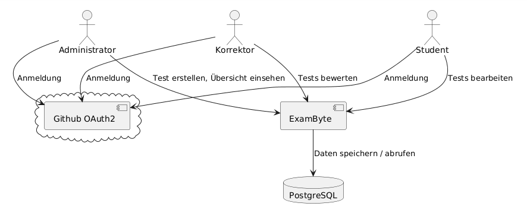

# ExamByte – Architecture Documentation (arc42)

## Meta Information

> - **Title**: ExamByte – Architecture Documentation (arc42)
> - **Author**: Marvin0109
> - **Version**: 1.3
> - **Created on**: February 03, 2025
> - **Updated on**: March 24, 2026
> - **Target audience**: Developers, users
> - **Tools used**: PlantUML

## Overview

- [1. Introduction and Goals](#1-introduction-and-goals)
  - [1.1 Task definition](#11-task-definition)
  - [1.2 Quality Goals](#12-quality-goals)
  - [1.3 Stakeholders](#13-stakeholders)
- [2. Constraints](#2-constraints)
  - [2.1 Technical Constraints](#21-technical-constraints)
  - [2.2 Organizational Constraints](#22-organizational-constraints)
  - [2.3 Conventions](#23-conventions)
- [3. Context and Scope](#3-context-and-scope)
  - [3.1 Business Context](#31-business-context)
- [4. Solution Strategy](#4-solution-strategy)
  - [4.1 Architecture Overview](#41-architecture-overview)
  - [4.2 Main Components](#42-main-components)
- [5. Building Block View](#5-building-block-view)
- [6. Runtime View](#6-runtime-view)
  - [6.1 Creating an Exam](#61-creating-an-exam)
  - [6.2 Exam Execution](#62-exam-execution)
  - [6.3 Exam Grading](#63-exam-grading)
  - [6.4 Admission Status](#64-admission-status)
- [7. Deployment View](#7-deployment-view)
- [8. Quality Scenarios](#8-quality-scenarios)
- [9. Risks and Technical Debt](#9-risks-and-technical-debt)
- [10. Glossar](#10-glossary)

## 1. Introduction and Goals

### 1.1 Task Definition

ExamByte is a web application for managing and conducting exams in programming lab courses.  
It replaces ILIAS as the system for exam admission for the final exam. 
The application enables test execution, manual grading of free-text answers by reviewers, 
and result evaluation for students and [administrators](#10-glossary).

### 1.2 Quality Goals

**Already implemented / partially implemented:**
- **Usability:** The application is mostly intuitive for students, reviewers, and administrators; further 
improvements are still possible.
- **Security:** Login is handled via GitHub [OAuth](#10-glossary) for secure authentication.
- **Automation:** Multiple-choice and single-choice questions are automatically graded.

**Planned / not fully implemented yet:**
- **Traceability:** A clear overview of test results and admission status is partially implemented 
and will be improved further.
- **Scalability:** Support for parallel exam execution for a growing number of users is planned but 
partially implemented.

### 1.3 Stakeholders

| Role           | Interest                            |
|----------------|-------------------------------------|
| Students       | Take tests, view exam results       |
| Reviewers      | Grade free-text answers             |
| Administrators | Manage tests and review results     |
| Developers     | Maintenance and further development |

---

## 2. Constraints

### 2.1 Technical Constraints

| Constraint                | Explanation                                                                      |
|---------------------------|----------------------------------------------------------------------------------|
| Operating system support  | Any Linux distribution or Windows with WSL is supported                          |
| Java implementation       | The application was developed in a Java-heavy semester. Development uses Java 21 |
| Free third-party software | GitHub OAuth is required for authentication and is free for personal use         |

### 2.2 Organizational Constraints

| Constraint                | Explanation                                                                                                                                                                                                                                                                                  |
|---------------------------|----------------------------------------------------------------------------------------------------------------------------------------------------------------------------------------------------------------------------------------------------------------------------------------------|
| Team                      | Marvin0109                                                                                                                                                                                                                                                                                   |
| Schedule                  | Development started at the beginning of November 2024                                                                                                                                                                                                                                        |
| Development approach      | The project was developed in parallel to the *Programmierpraktikum 2* course. Methods such as *domain storytelling* were only introduced during the course and were therefore not available at the beginning, which impacted development time. The architecture documentation follows arc42. |
| Development tools         | The system design was already known from using the ILIAS system during studies. Work results are collected in the [activity log](activity-log.md). Java source code was developed using IntelliJ IDEA Ultimate.                                                                              |
| Version control           | Git, GitHub                                                                                                                                                                                                                                                                                  |
| Testing tools and process | JUnit, ArchUnit, integration tests, WebMvc tests, and Testcontainers for database testing.                                                                                                                                                                                                   |

### 2.3 Conventions

| Convention                 | Explanation                                                                                                                   |
|----------------------------|-------------------------------------------------------------------------------------------------------------------------------|
| Architecture documentation | This document describes the software architecture and is version 1.3, which represents the first complete and stable version. |
| Java coding conventions    | Java code follows the Google Java Format, enforced using the Google Java Format plugin integrated into the IDE                |

All other conventions: [Style guide here](style-guide.md)

---

## 3. Context and Scope

### 3.1 Business Context

*Figure 1: Context diagram of ExamByte*

The diagram shows ExamByte at the center, external actors (students, reviewers, administrators), 
as well as external systems (GitHub OAuth2, PostgreSQL) and their interactions.

---

## 4 Solution Strategy

### 4.1 Architecture Overview

The application follows a classic **client-server architecture:**

- **Frontend:** Web interface using HTML and Thymeleaf
- **Backend:** Spring Boot application with Spring MVC
- **Database:** PostgreSQL connected via JPA

### 4.2 Main Components

- **User management:** Role handling, GitHub login
- **Test management:** Creation, editing, and publishing of tests
- **Grading system:** Automatic grading of [MC/SC](#10-glossary) questions, manual grading of free-text answers
- **Results view:** Visualization of test results for all stakeholders

---

## 5 Building Block View

- **Controller layer:** Handles incoming requests
- **Service layer:** Business logic and validation
- **Database layer:** Data storage and retrieval

---

## 6 Runtime View

### 6.1 Creating an Exam

1. Professors define the number of question types and let the server generate the form.
2. They set the relevant times (start time, deadline, result publication time).
3. They fill out the exam form with questions, answer options, points, etc., and submit the form.
4. Exporting and previewing an exam is done on separate pages.

### 6.2 Exam Execution

1. Students log in using their GitHub account.
2. They navigate to the exam overview and start an active exam.
3. They answer the questions, and the result of the automatic grading is displayed.
4. Multiple exam attempts are allowed; however, only the last attempt counts for admission.
5. After the exam deadline, editing is disabled and final results become visible after a defined release period.
6. The admission status is always visible and continuously updated.

### 6.3 Exam Grading

1. MC/SC questions are graded automatically.
2. Reviewers can view and grade answers to free-text questions.
3. If needed, professors can also create a new grading; the same applies to reviewers.

### 6.4 Admission Status

After a certain number of exams (12 tests), the admission status is updated and indicates whether
the admission requirement has been met or not.

---

## 7 Deployment View

- **Client:** Web browser (executes HTML/CSS, sends HTTP requests)
- **Application server:** Spring Boot application (Spring MVC, business logic, Thymeleaf rendering)
- **Database server:** PostgreSQL database

---

## 8 Quality Scenarios

| Quality goal | Scenario                                                                                                                                                                           |
|--------------|------------------------------------------------------------------------------------------------------------------------------------------------------------------------------------|
| Security     | An unauthenticated user tries to start an exam. The system denies access and redirects to the login page.                                                                          |
| Scalability  | The system is currently designed for a typical number of concurrent users. High-load scenarios (e.g., very large courses with up to 800 students) are not considered a known risk. |
| Availability | During an ongoing exam, the system remains available, and outages do not result in loss of already submitted answers.                                                              |                                                     |

---

## 9 Risks and Technical Debt

- **Possible risks:**
  - **Availability of GitHub OAuth integration**, especially dependency on the OAuth application  
    (no login possible if GitHub is unavailable)
  - **Concurrent grading of a task**, possible [race condition](#10-glossary)

---

## 10 Glossary

| Term           | Meaning                                                                                                                     |
|----------------|-----------------------------------------------------------------------------------------------------------------------------|
| MC             | Multiple choice                                                                                                             |
| SC             | Single choice                                                                                                               |
| Administrators | Since this application is used between students and professors, the term administrator refers to professors                 |
| OAuth          | Open authentication protocol                                                                                                |
| Race condition | A race condition occurs when multiple threads or processes access shared data and the result depends on the execution order |

[Back to overview](#overview)