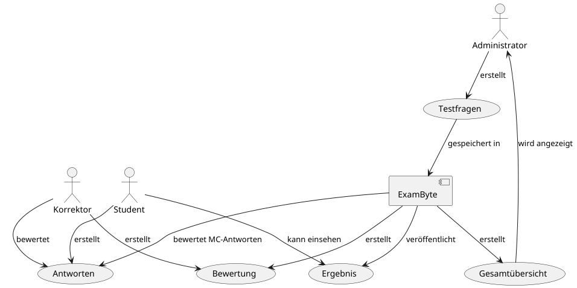

# ExamByte - Architektur-Dokumentation (arc42)

## Metainformationen

- **Titel**: ExamByte - Architektur-Dokumentation (arc42)
- **Autor**: Marvin0109
- **Version**: 1.3
- **Erstellt am**: 03. Februar 2025
- **Aktualisiert am**: 21. Januar 2026
- **Zielgruppen**: Entwickler, Benutzer
- **Verwendete Werkzeuge**: PlantUML

## 1. Einführung und Ziele

### 1.1 Aufgabenstellung

ExamByte ist eine Webanwendung zur Verwaltung und Durchführung von Prüfungen im Programmierpraktikum. 
Sie ersetzt Ilias als System zur Zulassung für die Abschlussprüfung. Die Anwendung ermöglicht die Durchführung von Tests, 
manuelle Bewertung von Freitextaufgaben durch Korrektor:innen und eine Ergebnisauswertung für Studierende und 
Administrator:innen.

### 1.2 Qualitätsziele

**Bereits umgesetzt / teilweise umgesetzt:**
- **Benutzerfreundlich:** Die Bedienung ist größtenteils intuitiv für Studierende, Korrektor:innen und Administrator:innen; weitere Optimierungen sind noch möglich.
- **Sicherheit:** Anmeldung erfolgt über Github OAuth zur sicheren Authentifizierung.
- **Automatisierung:** Multiple-Choice- und Single-Choice-Aufgaben werden automatisch bewertet.

**Geplante / noch nicht vollständig umgesetzte Ziele:**
- **Nachvollziehbarkeit:** Klare Statusübersicht über Testergebnisse und Zulassung ist teilweise vorhanden und soll weiter verbessert werden.
- **Skalierbarkeit:** Unterstützung paralleler Testdurchführungen für eine wachsende Anzahl von Nutzer:innen ist vorgesehen, aktuell aber noch nicht umgesetzt.

### 1.3 Stakeholder

| Rolle               | Interesse                                       |
|---------------------|-------------------------------------------------|
| Studierende         | Teilnahme an Tests, Prüfungsergebnisse einsehen |
| Korrektor:innen     | Bewertung von Freitextaufgaben                  |
| Administrator:innen | Testverwaltung, Ergebnisse überprüfen           |
| Entwickler:innen    | Wartung und Weiterentwicklung                   |

## 2. Randbedingung

### 2.1 Technische Randbedingungen

| Randbedingung                | Erläuterung                                                                                           |
|------------------------------|-------------------------------------------------------------------------------------------------------|
| Betrieb auf Betriebssystemen | Jegliche Linux Distro oder auch Windows mit WSL erwünscht                                             |
| Implementierung in Java      | Anwendung wurde im Java-lastigen Semester entwickelt. Entwicklung unter Version Java 21.              |
| Fremdsoftware frei verfügbar | Für die Authentifizierung ist die GitHub OAuth App nötig, welche kostenlos ist für den Eigengebrauch. |

### 2.2 Organisatorisch

| Randbedingung                    | Erläuterung                                                                                                                                                                                                                                                                                                                                      |
|----------------------------------|---------------------------------------------------------------------------------------------------------------------------------------------------------------------------------------------------------------------------------------------------------------------------------------------------------------------------------------------------------|
| Team                             | Marvin0109                                                                                                                                                                                                                                                                                                                                              |
| Zeitplan                         | Beginn der Entwicklung Anfang November 2024                                                                                                                                                                                                                                                                                                             |
| Vorgehensmodell                  | Das Projekt wurde parallel zur Vorlesung *Programmierpraktikum 2* entwickelt. Methoden wie *Domain Storytelling* wurden erst im Laufe der Veranstaltung eingeführt und standen daher zu Projektbeginn **nicht** zur Verfügung, was Auswirkungen hatte auf die Entwicklungszeit.   Zur Dokumentation der Architektur kommt arc42 zum Einsatz. |
| Entwicklungswerkzeuge            | Der Entwurf war schon bekannt durch das verwenden des Ilias System im Studium. Arbeitsergebnisse sind im [Aktivitätsprotokoll](Activity_Protocol.md) gesammelt worden. Erstellung von Java-Quellcode in IntelliJ Ultimate.                                                                                                                              |
| Versionsverwaltung               | Git, Github                                                                                                                                                                                                                                                                                                                                             |
| Testwerkzeuge und -prozesse      | JUnit, ArchUnit, Integrationstests, WebMvcTests und Testcontainer für Datenbanktests.                                                                                                                                                                                                                                                                   |
| Veröffentlichung als Open Source | N/A                                                                                                                                                                                                                                                                                                                                                     |

### 2.3 Konventionen

| Konvention                 | Erläuterung                                                                                                                                                                                                           |
|----------------------------|-----------------------------------------------------------------------------------------------------------------------------------------------------------------------------------------------------------------------|
| Architekturdokumentation   | Dieses Dokument stellt die Architektur der Software dar und befindet sich in der Version 1.3, welche die erste vollständige und stabile Version ist.                                                                  |
| Kodierrichtlinien für Java | Java Format nach Google-Java-Format, geprüft mit Hilfe von in der IDE eingebautem Google-Java-Format Plugin                                                                                                           |

Alles Weitere an Konventionen: [Styleguide hier](STYLEGUIDE.md)

## 3 Kontextabgrenzung

### 3.1 Fachlicher Kontext

*Abbildung 1: Kontextabgrenzungsdiagramm von ExamByte*

Das Diagramm zeigt ExamByte im Zentrum, die externen Akteure (Studierende, Korrektor:innen, Administrator:innen) sowie externe Systeme (Github OAuth2, PostgreSQL) und deren Interaktionen.

## 4 Lösungssicht

### 4.1 Architekturübersicht

Die Anwendung folgt einer klassischen **Client-Server-Architektur:**

- **Frontend:** Weboberfläche mit HTML und Thymeleaf
- **Backend:** Spring-Boot-Anwendung mit Spring-MVC
- **Datenbank:** PostgreSQL, angebunden über JPA

### 4.2 Hauptkomponenten

- **Benutzermanagement:** Rollenverwaltung, Github-Login
- **Testverwaltung:** Erstellung, Bearbeitung und Veröffentlichung von Tests
- **Bewertungssystem:** Automatische MC-/SC-Bewertung, manuelle Freitextbewertung
- **Ergebnisanzeige:** Visualisierung der Testergebnisse für alle Beteiligten

## 5 Bausteinsicht

- **Controller-Schicht:** Bearbeitung von Anfragen
- **Service-Schicht:** Geschäftslogik und Validierung
- **Datenbank-Schicht:** Speicherung und Abruf von Daten

## 6 Laufzeitsicht

### 6.1 Erstellung eines Tests

1. Administrator:innen (besser gesagt: Professor:innen) erstellen einen Test.
2. Sie füllen das Testformular aus mit Fragestellungen, Antwortmöglichkeiten, Punkte, ...
3. Sie setzen die relevanten Zeiten fest (Startzeit, Frist, Veröffentlichung der Ergebnisse).
4. Das Exportieren eines Tests erfolgt über einer anderen Seiten.

### 6.2 Testdurchführung

1. Studierende melden sich mit ihren Github-Account an.
2. Sie gehen zur Testübersicht und starten einen aktiven Test.
3. Sie beantworten die Fragen und das Ergebnis der automatischen Korrektur ist sichtbar.
4. Unzählige Testdurchläufe sind seitdem möglich, bewertet für die Zulassung wird aber nur der letzte Versuch.
5. Nach Ablauf der Testzeit wird die Bearbeitung gesperrt und die endgültigen Ergebnisse werden nach einer gewissen Zeit sichtbar sein.
6. Der Zulassungsstatus ist immer einsehbar und wird aktualisiert.

### 6.3 Bewertung eines Tests

1. MC-/SC-Fragen werden automatisch bewertet.
2. Freitextantworten können die Korrektoren einsehen und bewerten.
3. Nach Bedarf kann auch der Professor:in eine neue Bewertung erstellen, dies gilt auch für den Korrektoren.

### 6.4 Zulassungsstatus

Nach einer bestimmten Anzahl an Tests (12 Tests) wird der Zulassungsstatus aktualisiert und gibt bekannt, ob die 
Zulassung erreicht wurde oder nicht.

## 7 Verteilungssicht

- **Client:** Webbrowser (führt HTML/CSS aus, stellt HTTP-Anfragen)
- **Applikationsserver:** Spring-Boot-Anwendung (Spring MVC, Geschäftslogik, Thymeleaf-Rendering)
- **Datenbankserver:** PostgreSQL-Datenbank

## 8 Qualitätsszenarien

| Qualitätsziel  | Szenario                                                                                                                                                         |
|----------------|------------------------------------------------------------------------------------------------------------------------------------------------------------------|
| Sicherheit     | Ein nicht authentifizierter Benutzer versucht, einen Test zu starten. Das System verweigert den Zugriff und leitet zur Login-Seite weiter.                       |
| Skalierbarkeit | Das System ist derzeit für eine begrenzte Anzahl gleichzeitiger Nutzer ausgelegt. Hohe Lastsituationen (z. B. sehr große Kurse) stellen ein bekanntes Risiko dar.|
| Verfügbarkeit  | Während eines laufenden Tests ist das System erreichbar und Ausfälle führen nicht zum Verlust bereits abgegebener Antworten.                                     |

## 9 Risiken und technische Schulden

- **Mögliche Risiken:**
  - **Überlastung der Server bei hoher Nutzerzahl**, da derzeit keine horizontale Skalierung oder Lastverteilung implementiert ist.
  - **Sicherheit der GitHub-OAuth-Integration**, insbesondere im Umgang mit Tokens und Zugriffsbeschränkungen.

## 10 Glossar

| Begriff             | Bedeutung                                                                                                                         |
|---------------------|-----------------------------------------------------------------------------------------------------------------------------------|
| MC                  | Multiple-Choice                                                                                                                   |
| Administrator:innen | Da es sich um eine Anwendung zwischen Studierende und Professoren handelt, ist hier der Administrator:in mit Professor:in gemeint |
| OAuth               | Offenes Authentifizierungsprotokoll                                                                                               |
| SC                  | Single-Choice                                                                                                                     |

